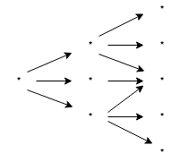
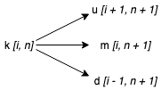

# Implementing a Generalized Bi/Trinomial Tree Pricing Algorithm

## Illustrating the Trees

The following are illustrations for examples used in these notes. They are a binomial and trinomial tree with *N* = 2 steps. For each tree, first the example is illustrated using text, and then the representation of that information in a matrix (will be referenced later).

### Binomial Tree Illustration

- Binomial tree illustration:


- Binomial tree matrix representation:

<pre>
    | 0  0  * |
    | 0  *  0 |
<b>B</b> = | *  0  * |
    | 0  *  0 |
    | 0  0  * |
</pre>

### Trinomial Tree Illustration

- Trinomial tree illustration:



- Trinomial tree matrix representation:

<pre>
    | 0  0  * |
    | 0  *  * |
<b>T</b> = | *  *  * |
    | 0  *  * |
    | 0  0  * |
</pre>

## Terminology - Indexing the Matrix

> Note: Using indexing that starts from 1 in this document.

To index each of these values, we can use regular matrix indexing notation. That is, *i* will correspond to the **row** of the matrix, and *j* will correspond to the **column** of the matrix.

For example (considering the examples detailed above):

- **T**[3, 1] = * (the first node (i.e. root) of the tree)
- **T**[1, 1] = 0 (the top left node of the tree)

and so on...

### Time Steps and Indexing

Note that this indexing scheme makes it easy for us to reference the children of a target node, *k*, with relative ease.

To illustrate this, assume that we have the following information:

- *n* = time step of the target node, *k*
- *i* = row of the target node, *k*

Furthermore, the following notation will be used:

- *u* = upper child of a node
- *m* = middle child of a node
- *d* = lower child of a node

With this, we can state (*m* = 0 for the Binomial tree, **B**):

- *u* = **T**[*i* - 1, *n* + 1]
- *m* = **T**[*i*, *n* + 1]
- *d* = **T**[*i* + 1, *n* + 1]

This relationship is illustrated in the diagram below:




## Constructing the Tree

### Matrix Size

The matrix must have the following dimensions:

- Number of columns (i.e. *j_max*) = N + 1 (i.e. number of steps + 1)
- Number of rows (i.e. *i_max*) = 2N + 1
    - Simple derivation; just draw a few trees and look at the pattern of the number of nodes in the last time step)

### Building the Matrix representation of the Tree

This can be done relatively easily by iterating over each of the values in a top -> down, left -> right pattern (i.e. by column, then by row).

Then, for every (non-zero checking can be done here too of course) value encountered, simply compute and set the values of the children using whatever modification function you want, and assign it to the matrix value in the relevant slot.

The pseudocode for this computation is outlined below:

```python
# Define number of time steps
set N = 2  # Same as examples discussed above

# Define number of rows and columns
set rows = (2 * N) + 1
set columns = N + 1

set T = Matrix(rows=rows, columns=columns)

# Set the middle row of the first column to the initial value
# Note: For 0-based indexing (NOT THIS EXAMPLE), mid_index = floor(rows / 2)
set mid_index = ceiling(rows / 2)
set T[mid_index, 1] = initial_value

# Iterate over columns
for j in (1 to (column - 1)):
    # Iterate over rows
    for i in (1 to rows):
        # Current node = T[i, j]
        current_node = T[i, j]

        # Set up child
        T[i - 1, j + 1] = setUpChild(input=current_node)
        # Set mid child
        T[i, j + 1] = setMidChild(input=current_node)
        # Set down child
        T[i + 1, j + 1] = setDownChild(input=current_node)

# Return the constructed tree
return T
```

### Reverse Traversal of the Tree

To compute the option price from the price tree, we need to traverse it from right to left (i.e. in reverse). This can be achieved by simply reversing the direction of the outer loop in the pseudocode above.

Any updates to the nodes in the tree can be made, using each of the child nodes as inputs.

In the pseudocode below, assume that we have the functions:

- `optionValue`: Gets the value of the option, given the computed underlying price (eg: for call, this would simply be *max(0, `child_node_value` - K)*, etc.)
- `pricingFunction`: Computes value of parent node, based on value of child nodes (this is the function that would use probabilities of each of the edges; *p_u*, *p_m*, and *p_d*)

```python
# Iterate over columns
for j in ((column - 1) to 1):  # Reverse loop
    # Iterate over rows
    for i in (1 to rows):
        # If it is a node with value 0, go to next iteration
        if T[i, j] == 0:
            continue  # Go to next iteration

        # Get up child, apply option value function
        upChild = optionValue(T[i - 1, j + 1])
        # Get mid child, apply option value function
        midChild = optionValue(T[i, j + 1])
        # Get down child, apply option value function
        downChild = optionValue(T[i + 1, j + 1])

        # Set current node (T[i, j]) to some function of children
        T[i, j] = pricingFunction(upChild, midChild, downChild)

# Return the root of the tree, with updated recursive function call of all
# the children
return T[mid_index, 1]
```
